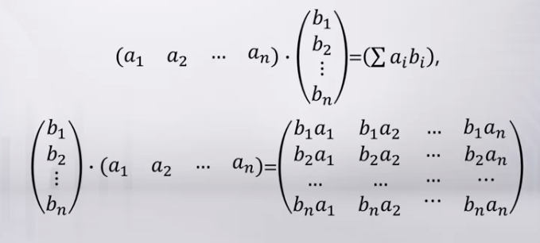

## Rows and columns of matrix. Transposition. Rank

$\mathbb{R}^{1 \times m}$ - không gian vector hàng với dimension $m$.

$\mathbb{R}^{n \times 1}$ - không gian vector cột với dimension $n$.

Bất kì ma trận  $\textbf{A} \in \mathbb{R}^{m \times n} , \textbf{A} = (a_{ij})$ cũng có thể được biểu diễn thông qua các vector hàng hoặc vector cột của chúng.

Ví dụ biểu diễn ma trận như cột của các vector hàng:
$$ \textbf{A} = \begin{bmatrix}
a_{1*} \\
a_{2*} \\
... \\
a_{m*}\end{bmatrix}, a_{i*} = [a_{i1}, a_{i2}...a_{in} ], i=1, 2, ..., m  $$

Frobenius norm: $ \left\| \textbf{A} \right\|_F^{2} = \left\| a_{1*} \right\|_2^{2} + \left\| a_{2*} \right\|_2^{2} + ... + \left\| a_{m*} \right\|_2^{2} $

Ví dụ biểu diễn ma trận như hàng của các vector cột:

$$ \textbf{A} = \begin{bmatrix} a_{*1} a_{* 2} ... a_{*n}\end{bmatrix}, a_{*j} = \begin{bmatrix}
a_{1j} \\ 
a_{2j} \\
... \\
a_{mj} \end{bmatrix}, j=1, 2, ..., n  $$

Frobenius norm: $ \left\| \textbf{A} \right\|_F^{2} = \left\| a_{* 1} \right\|_2^{2} + \left\| a_{*2} \right\|_2^{2} + ... + \left\| a_{*n} \right\|_2^{2} $

Ma trận  $A \in \mathbb{R}^{m \times n} $ có ma trận chuyển vị là ma trận  $A^{T} \in \mathbb{R}^{n \times m} $. Ma trận ban đầu viết dưới dạng vector cột của các hàng, khi chuyển vị hàng sẽ biến thành cột, do đó ma trận chuyển vị có các cột là chuyển vị của các hàng.
$$ \textbf{A} = \begin{bmatrix}
a_{1*} \\
a_{2*} \\
... \\
a_{m*}\end{bmatrix}, \textbf{A}^T = [a_{1*}^T, a_{2*}^T ... a_{m*}^T ] $$

Ma trận ban đầu viết dưới dạng vector hàng của các cột, khi chuyển vị cột sẽ biến thành hàng, do đó ma trận chuyển vị có các hàng là chuyển vị của các cột.

$$ \textbf{A} = \begin{bmatrix} a_{*1} a_{*2} ... a_{*n}\end{bmatrix},  \textbf{A}^T = \begin{bmatrix}
a_{*1}^T \\
a_{*2}^T \\
... \\
a_{*m}^T \end{bmatrix}$$

Một số tính chất của ma trận chuyển vị:
* $(\textbf{A}^T)^T = \textbf{A}$
* $(\textbf{A} + \textbf{B})^T = \textbf{A}^T + \textbf{B}^T$
* $ (c \textbf{A})^T= c \textbf{A}^T$

Frobenius norm: $ \left\| \textbf{A} \right\|_F = \left\| \textbf{A}^T \right\|_F $

## Rank of matrix (Hạng của ma trận)

**Motivation:** Trong xử lý số liệu các quan sát thường được biểu diễn dưới dạng matrix. Mỗi hàng của matrix là một quan sát, giá trị ở các cột tương ứng với feature (hoặt attribute) của quan sát.

$ \textbf{X} = (a_{i j})$, $i=1..n $ là số thự tự quan sát, $j=1..m$ là số thứ tự của feature.

**Dimension reduction problem**: chúng ta có thể giảm số lượng features hay số lượng quan sát mà vẫn không mất thông tin. Rank of matrix (hạng của ma trận) giúp ta giải quyết vấn đề này.

**Hạng của ma trận** $\textbf{A} \in \mathbb{R}^{m \times n} $ là số lượng lớn nhất các cột độc lập tuyến tính, đó cũng chính là số lượng lớn nhất các hàng độc lập tuyến tính, như vậy thì
$$rank(\textbf{A}) \leq min\left\{m, n \right\}$$

Hạng của ma trận bằng số chiều của:
* Không gian con $span(a_{1 *}, a_{2 *}...a_{m*}) \in \mathbb{R}^{1 \times n}$ - không gian con của các vector hàng (tìm ra số lượng vector lớn nhất đọc lập tuyến tính)
* Không gian con $span(a_{*1}, a_{*2}...a_{*n}) \in \mathbb{R}^{m \times 1}$ - không gian con của các vector cột (tìm ra số lượng vector lớn nhất đọc lập tuyến tính)

Một số tính chất:
* $rank(\textbf{A}^T) = rank(\textbf{A})$
* $rank(\textbf{A}) = dim(span(a_{1*}, a_{2*}...a_{m*}))$
* $rank(\textbf{A}) = dim(span(a_{*1}, a_{*2}...a_{*n}))$

Ví dụ: $\textbf{A} = \begin{bmatrix}
 &2  &0  &-1  &3  &0  &1\\
 &6  &0  &-3  &9  &0  &3\\
\end{bmatrix}$

$rank(\textbf{A}) = 1$ do $a_{2*} = 3a_{1*}$

Để xác định hạng của ma trận có thể dùng phương pháp Gaussian (giống khi giải hệ phương trình). Các bạn tự tìm hiểu thêm cách thực hiện nhé. 

**Dot product** tương đương với inner product nhưng ở đây hướng tới kiểu nhân ma trận. 