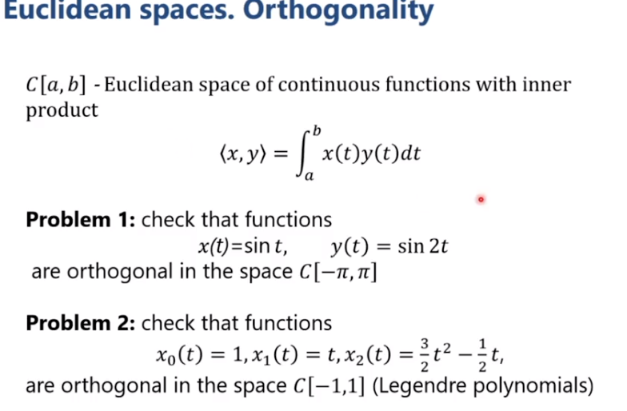

Euclidean spaces. Orthogonality - Không gian Euclid, tính trực giao

Không gian Euclid là một trường hợp của không gian vector. Ở trong đó xác định thêm phép tính đặc biệt đó là **inner product (scalar product) (tích vô hướng)**. Inner product của 2 vector $ \mathbf{x}, \mathbf{y} $ được kí hiệu là $ \left< \mathbf{x}, \mathbf{y} \right> $

Một số tiên đề với inner product:
* Inner product không âm. $ \left< \mathbf{x}, \mathbf{x} \right> $
* Có tính đối xứng: $ \left< \mathbf{x}, \mathbf{y} \right> = \left< \mathbf{y}, \mathbf{x} \right> $
* $ \left< \alpha \mathbf{x}, \mathbf{y} \right> = \alpha \left< \mathbf{x}, \mathbf{y} \right> $, $ \left< \mathbf{x+z}, \mathbf{y} \right> = \left< \mathbf{x}, \mathbf{y} \right> + \left< \mathbf{z}, \mathbf{y} \right>$

Norm liên hệ với inner product thông qua công thức sau:
$$ \left\| \mathbf{x}\right\| = \sqrt{\left< \mathbf{x}, \mathbf{x} \right>} $$

Norm này thỏa mãn các tiên đề về norm, cụ thể như sau:
* $ \left\| \mathbf{x}\right\| = \sqrt{\left< \mathbf{x}, \mathbf{x} \right>} \geq 0$. Dấu bằng xảy ra khi và chỉ khi $ \mathbf{x} = \mathbf{0} $
* $ \alpha \left\| \mathbf{x}\right\| = \sqrt{\left< \alpha \mathbf{x}, \alpha \mathbf{x} \right>} = \sqrt{ \alpha^2 \left< \mathbf{x}, \mathbf{x} \right>} = \left| \alpha \right| \left\| \mathbf{x}\right\| $
* Bất đẳng thức Cauchy - Bunyakovsky - Schwartz: 
$$ \left| \left< \mathbf{x}, \mathbf{y} \right> \right| \leq \left\| \mathbf{x}\right\| \left\| \mathbf{y}\right\| $$

Một ví dụ của inner product là **dot product**. Cho $ \mathbf{x}, \mathbf{y} \in \mathbb{R}^n$. Dot product được kí hiệu là $  (\mathbf{x}, \mathbf{y})$ hay $ \mathbf{x} \cdot \mathbf{y} $:
$$ (\mathbf{x}, \mathbf{y}) =  \mathbf{x} \cdot \mathbf{y} = \sum_{i=1}^{n}x_i y_i$$

Euclidean norm:
$$ \left\|\mathbf{x} \right\| = \left (\sum_{i=1}^{n}\left| x_i \right|^2  \right )^\frac{1}{2} = \left\|\mathbf{x} \right\|_{2}  $$

Chúng ta có thể xem thêm ví dụ Eucledian space là không gian các hàm số liên tục trên đoạn [a, b] [tại đây](https://www.coursera.org/learn/mathematics-for-computer-vision/lecture/NWwaL/euclidean-spaces-orthogonality).

Đối với inner product chúng ta sẽ có loại similarity mới là **cosine similarity**:
$$ cos(\mathbf{x} , \mathbf{y} ) = \frac{\left< \mathbf{x}, \mathbf{y} \right>}{\left\|\mathbf{x} \right\| \left\|\mathbf{y} \right\|}  $$

$$ -1\leq cos(\mathbf{x} , \mathbf{y} )\leq  1 $$

**Orthogonality - tính trực giao**
Trong không gian Euclid 2 vector được gọi là trực giao nếu $ \left< \mathbf{x}, \mathbf{y} \right> \Leftrightarrow cos(\mathbf{x} , \mathbf{y} ) = 0 $

Trong data mining, sự trực giao gần với khái niệm independence của 2 mảng dữ liệu. 
