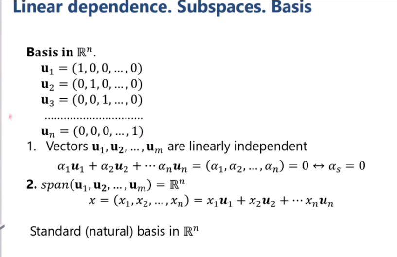
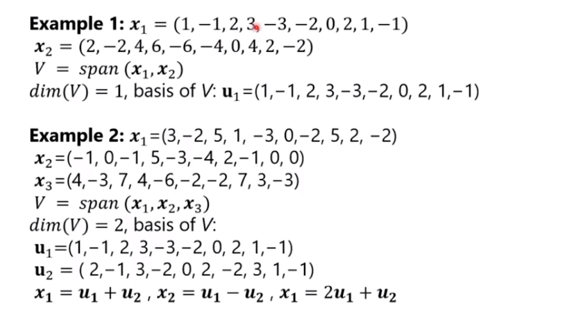

**Linear dependence** (phụ thuộc tuyến tính) cho phép chúng ta giảm chiều của vấn đề quan tâm và loại bỏ các thông tin dư thừa.
Ví dụ: cho 2 vector biểu diễn các mảng dữ liệu:
$$ \mathbf{x} = (1, 2, -2, 3), \mathbf{y} = (2, 4, -4, 6) $$

Nhận thấy $ \mathbf{y} = 2 \mathbf{x} $. Điều n ày có nghĩa rằng $ \mathbf{y} $ không mang lại thông tin gì mới.

Cùng xem một ví dụ khác, cho 3 vector 
$$ \mathbf{x} = (1, 2, -2, 3), \mathbf{y} = (1, 3, 7, 5), \mathbf{z} = (2, 5, 5, 8) $$

Nhận thấy $ \mathbf{z} = \mathbf{x} + \mathbf{y} $. Điều này có nghĩa rằng chúng ta có thể xây dựng $ \mathbf{z} $ khi biết 2 vector $ \mathbf{x}, \mathbf{y} $. Đối với xử lý dữ liệu các thông tin quan trọng được cho bởi 2 vector $ \mathbf{x}, \mathbf{y} $.

**Linear combination** (tổ hợp tuyến tính). Cho các vector $ \mathbf{x}_1, \mathbf{x}_2 ... \mathbf{x}_n \in \mathbb{R}^n $ và $ \alpha_1, \alpha_2 ... \alpha_n$ là các số vô hướng. Tổ hợp tuyến tính của các vector được định nghĩa như sau:

$$ \alpha_1 \mathbf{x}_1 + \alpha_2 \mathbf{x}_2 + ... + \alpha_n \mathbf{x}_n = \sum_{i=1}^{n}\alpha_i \mathbf{x}_i $$

Tổ hợp tuyến tính này là một vector. Tổ hợp tuyến tính gọi là tầm thường nếu tất cả các hệ số $ \alpha_i = 0$ và cho về một vector 0. Tổ hợp tuyến tính là không tầm thường nếu có ít nhất hệ số nào đó khác 0 và nó cũng có thể trả về một vector 0.

Bộ các vector $ \mathbf{x}_1, \mathbf{x}_2 ... \mathbf{x}_n $ gọi là phụ thuộc tuyến tính nếu tồn tại bộ tổ hợp tuyến tính không tầm thường bằng 0. 
$$ \alpha_1 \mathbf{x}_1 + \alpha_2 \mathbf{x}_2 + ... + \alpha_n \mathbf{x}_n = 0 $$

Bộ các vector là độc lập tuyến tuyến chỉ khi tổ hợp tuyến tính tầm thường các vector bằng 0 (các hệ số bằng 0).

Nếu các vector là phụ thuộc tuyến tính khi và chỉ khi 1 vector là toote hợp tuyến tính của các vector còn lại (chứng minh dễ, chuyển vế thôi).

**Subspaces** (không gian con)
Tập hợp con $ V \subset \mathbb{R}^n $ được gị là không gian con của không gian vector $\mathbb{R}^n $ nếu bản thân $ V $ cũng là một không gian vector với phép cộng vector và phép nhân vô hướng được định nghĩa trên $ \mathbb{R}^n $. Điều này có nghĩa rằng với bất kì $ \mathbf{x}, \mathbf{y} \in V $ và 2 số vô hường $\alpha, \beta$ chúng ta sẽ có $ \alpha \mathbf{x} + \beta \mathbf{y} \in V $. 

Linear operation trên vector $\in V$ cũng là vector $\in V$ do đó $V$ là một không gian tuyến tính.

Tổ hợp các vector $ \mathbf{x}_1, \mathbf{x}_2 ... \mathbf{x}_n \in \mathbb{R}^n $ tạo ra không gian con trong $ \mathbb{R}^n $. Không gian con này được gọi là **span** của bộ các vector đó.
$$ span(\mathbf{x}_1, \mathbf{x}_2 ... \mathbf{x}_n) = \left\{ \mathbf{x} \in \mathbb{R}^n: \mathbf{x} =\alpha_1 \mathbf{x}_1 + \alpha_2 \mathbf{x}_2 + ... + \alpha_n \mathbf{x}_n \right\} $$

**Basic** (cơ sở)
$ V \subset \mathbb{R}^n $ là không gian con của $\mathbb{R}^n$. Bộ các vectors $\mathbf{u}_1, \mathbf{u}_2 ... \mathbf{u}_n \in V$ được gọi là cơ sở của $V$ nếu:
**1.** Vectors $ \mathbf{u}_1, \mathbf{u}_2 ... \mathbf{u}_n $ độc lập tuyến tính
**2.** $span(\mathbf{u}_1, \mathbf{u}_2 ... \mathbf{u}_n) = V $

$V$ là không gian con của không gian vector. **Số lượng vector của bất kì cơ sở nào của không gian con $V$ đều như nhau và được gọi là chiều của $V$, kí hiệu là $dim(V)$.**

Có thể thấy:
* $dim(\mathbb{R}^n) = n$
* Bất kì không gian con $ V \subset \mathbb{R}^n $, $dim(V) \leq n$

