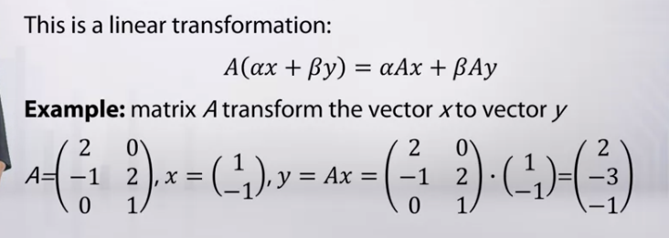
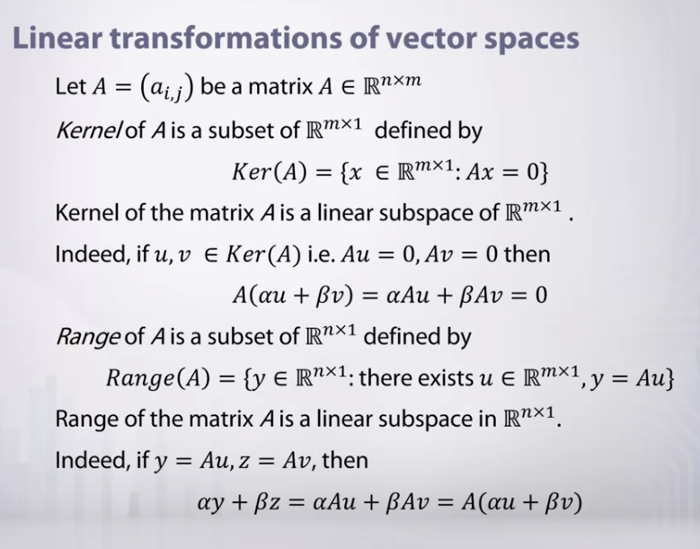
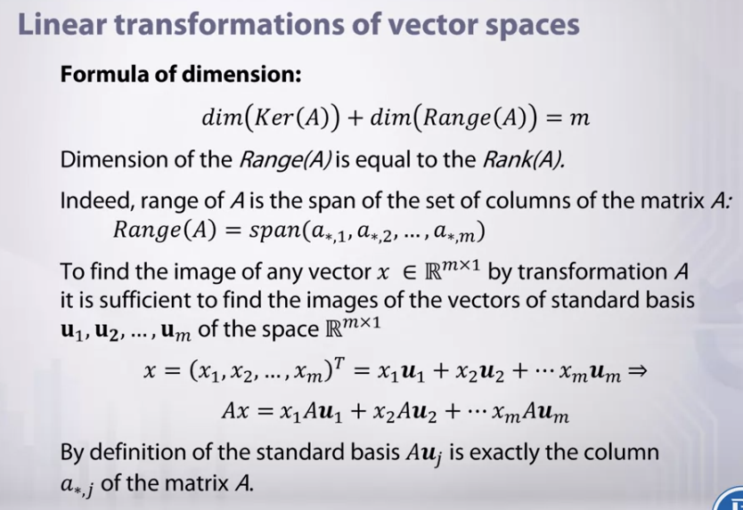

**Linear transformations of vector spaces**
Cho ma trận $\textbf{A} \in \mathbb{R}^{m \times n} $. Có thể sử dụng ma trận $\textbf{A}$ để cuyển đổi từ không gian $\mathbb{R}^{m \times 1} $ vào không gian $ \mathbb{R}^{n \times 1} $ bằng phép nhân ma trận:

$$ \textbf{y} = \textbf{A} \textbf{x} $$

Vector cột $ \textbf{x} \in \mathbb{R}^{m \times 1} $ được chuyển thành vector cột $ \textbf{y} \in \mathbb{R}^{n \times 1} $ bằng cách nhân với ma trận $\textbf{A}$.

$$ y_i = a_{i1}x_1 + a_{i2}x_2 + ... + a_{im}x_m = a_{i*} \cdot \textbf{x} $$

Phần tử của vector $\textbf{y}$ bằng dot product của hàng ma trận $\textbf{A}$ với vector cột $\textbf{x}$

#### Tài liệu tham khảo
1. https://www.coursera.org/learn/mathematics-for-computer-vision/lecture/LMQiL/linear-transformations-kernel-and-range-of-matrix

