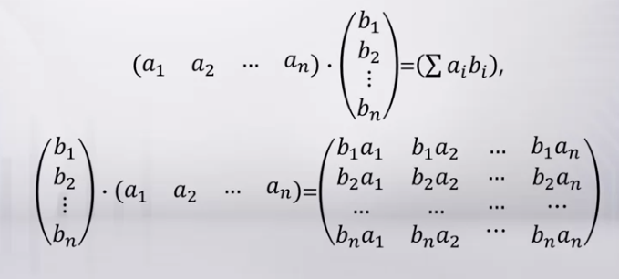
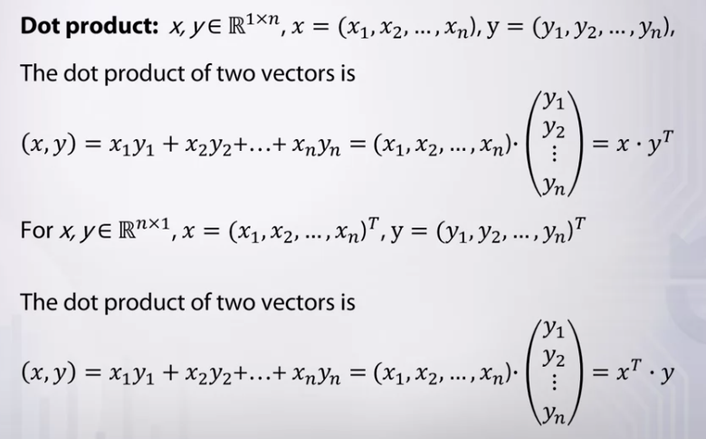

Matrix có thể hiểu là các vector xếp cạnh nhau hoặc bảng có $n$ hàng và $m$ cột. Sparse matrix là ma trận với phần lớn các phần tử bằng 0.

$\mathbb{R}$ là tập hợp các số nguyên. $\mathbb{R}^{m \times n}$ là không gian ma trận thực với chiều $m \times n$. $ A \in \mathbb{R}^{m \times n}, A = (a_{i, j})$. $a_{i, j}$ là phần tử của ma trận ở hàng $i$ và cột $j$.

Tổ hợp tuyến tính của hai ma trận:
$$ \alpha \textbf{A} + \beta \textbf{B} = (\alpha a_{i, j} + \beta b_{i, j}) $$

Frobenius norm của ma trận $ A \in \mathbb{R}^{m \times n} , A = (a_{i, j})$:

$$ \left\| \textbf{A} \right\|_F = \left ( \sum_{i=1}^{m}\sum_{j=1}^{n}\left|a_{i,j} \right|^2 \right )^\frac{1}{2} $$

Frobenius norm cuar ma trận chính là norm của flattened vector của ma trận đó.

Ma trận hàng $ \textbf{A} \in \mathbb{R}^{1 \times n}$, ma trận cột $ A \in \mathbb{R}^{m \times 1}$

Bất kì ma trận  $\textbf{A} \in \mathbb{R}^{m \times n} , \textbf{A} = (a_{i, j})$ cũng có thể được biểu diễn thông qua các vector hàng hoặc vector cột của chúng.

Ví dụ biểu diễn ma trận như cột của các vector hàng:
$$ \textbf{A} = \begin{bmatrix}
a_{1, *} \\
a_{2, *} \\
... \\
a_{m, *}\end{bmatrix}, a_{i, *} = [a_{i, 1}, a_{i, 2}...a_{i, n} ], i=1, 2, ..., m  $$

Frobenius norm: $ \left\| \textbf{A} \right\|_F^{2} = \left\| a_{1, *} \right\|_2^{2} + \left\| a_{2, *} \right\|_2^{2} + ... + \left\| a_{m, *} \right\|_2^{2} $

Ví dụ biểu diễn ma trận như hàng của các vector cột:

$$ \textbf{A} = \begin{bmatrix} a_{*, 1} a_{*, 2} ... a_{*, n}\end{bmatrix}, a_{*, j} = \begin{bmatrix}
a_{1, j} \\ 
a_{2, j} \\
... \\
a_{m, j} \end{bmatrix}, j=1, 2, ..., n  $$

Frobenius norm: $ \left\| \textbf{A} \right\|_F^{2} = \left\| a_{*, 1} \right\|_2^{2} + \left\| a_{*, 2} \right\|_2^{2} + ... + \left\| a_{*, n} \right\|_2^{2} $

Ma trận  $A \in \mathbb{R}^{m \times n} $ có ma trận nghịch đảo là ma trận  $A^{T} \in \mathbb{R}^{n \times m} $. 
$$ \textbf{A} = \begin{bmatrix}
a_{1, *} \\
a_{2, *} \\
... \\
a_{m, *}\end{bmatrix}, \textbf{A}^T = [a_{1, *}^T, a_{2, *}^T ... a_{m, *}^T ] $$

$$ \textbf{A} = \begin{bmatrix} a_{*, 1} a_{*, 2} ... a_{*, n}\end{bmatrix},  \textbf{A}^T = \begin{bmatrix}
a_{*, 1}^T \\
a_{*, 2}^T \\
... \\
a_{*, m}^T \end{bmatrix}$$

Một số tính chất của ma trận chuyển vị:
* $(\textbf{A}^T)^T = \textbf{A}$
* $(\textbf{A} + \textbf{B})^T = \textbf{A}^T + \textbf{B}^T$
* $ (c \textbf{A})^T= c \textbf{A}^T$

Frobenius norm: $ \left\| \textbf{A} \right\|_F = \left\| \textbf{A}^T \right\|_F $

**Rank of matrix** (Hạng của ma trận)
**Motivation:** Trong xử lý số liệu các quan sát thường được biểu diễn dưới dạng vector nhiều chiều. Thành phần của các vector này là các giá trị được gọi là features. Các quan sát có thể được biểu diễn bằng ma trận.

$ \textbf{A} = (a_{i, j})$, $i=1..n $ là số thự tự quan sát, $j=1..m$ là số thứ tự của feature.

**Dimension reduction problem**: chúng ta có thể giảm số lượng features hay số lượng quan sát mà vẫn không mất thông tin. Rank of matrix (hạng của ma trận) giúp ta giải quyết vấn đề này.

**Hạng của ma trận** $\textbf{A} \in \mathbb{R}^{m \times n} $ là số lượng lớn nhất các cột độc lập tuyến tính, đó cũng chính là số lượng lớn nhất các hàng độc lập tuyến tính, như vậy thì
$$rank(\textbf{A}) \leq min\left\{m, n \right\}$$

Hạng của ma trân bằng số chiều của:
* Không gian con $span(a_{1, *}, a_{2, *}...a_{m, *}) \in \mathbb{R}^{1 \times n}$
* Không gian con $span(a_{*, 1}, a_{*, 2}...a_{*, n}) \in \mathbb{R}^{m \times 1}$

Một số tính chất:
* $rank(\textbf{A}^T) = rank(\textbf{A})$
* $rank(\textbf{A}) = dim(span(a_{1, *}, a_{2, *}...a_{m, *}))$
* $rank(\textbf{A}) = dim(span(a_{*, 1}, a_{*, 2}...a_{*, n}))$

Để xác định hạng của ma trận có thể dùng phương pháp Gaussian (giống khi giải hệ phương trình).

**Dot product** tương đương với inner product nhưng ở đây hướng tới kiểu nhân ma trận. 

